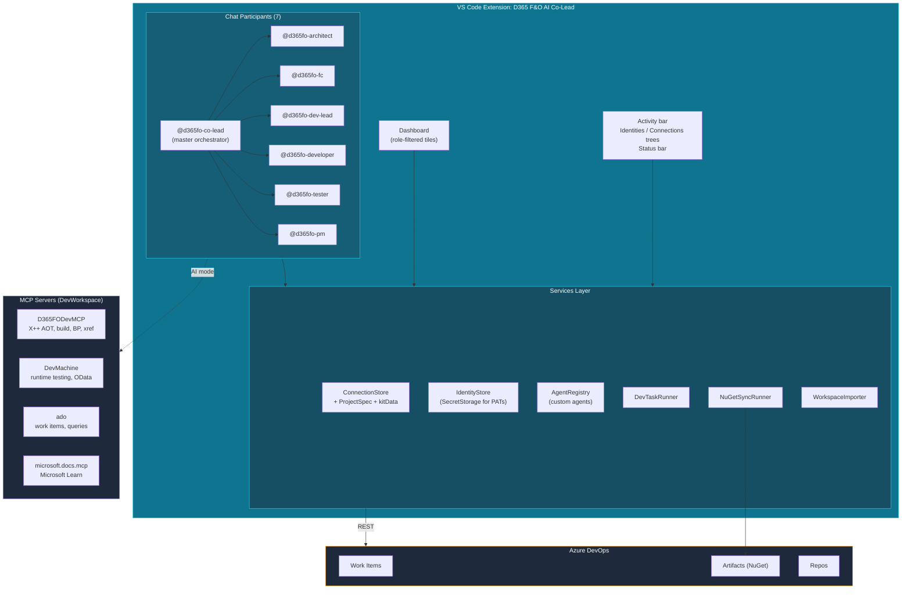
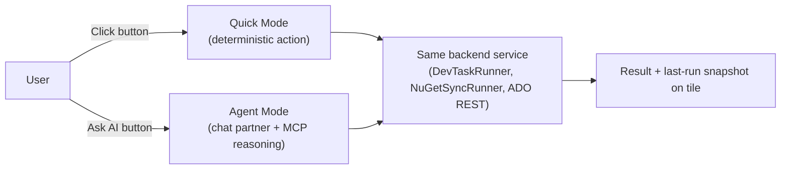

# D365 Finance & Operations AI Co-Lead

> Your AI partner across the **F&O delivery lifecycle** — Architect, FC, Dev Lead, Developer, Tester, PM. One VS Code extension. Six role-aware AI partners. An in-product Agent Factory. Powered by `D365FODevMCP`, `DevMachine`, and the Azure DevOps MCP.

[](LICENSE)

_Built by [@vjanardhana12](https://github.com/vjanardhana12). Distributed via [GitHub Releases](https://github.com/vjanardhana12/d365fo-ai-co-lead/releases/latest)._

---

## Pick your role — jump straight to your section

| | Role | What you get today (v1.0) | What's next (v1.1) |
|---|---|---|---|
| 🏛 | [Architect](#architect) | Manage Agents, Project Initiation Kit | Solution Design (HLD), per-agent Evals |
| 🎯 | [Functional Consultant](#functional-consultant) | Manage Agents, Project Initiation Kit | FDD Authoring, Configuration Workbook |
| 🧭 | [Dev Lead](#dev-lead) | NuGet Sync, Create Dev Tasks (with AI mode), Project Initiation Kit, CB Spec Kit | PR Triage, TDD from FDD, Status Reports |
| 💻 | [Developer](#developer-x) | NuGet Sync, Manage Agents | Implement-from-TDD, Fix BP/UT, Code Coverage |
| 🧪 | [Tester](#tester) | Manage Agents | Test Cases from FDD, Defect Triage, ATC/RSAT scaffolds |
| 📊 | [Project Manager](#project-manager) | (placeholder partner only) | Status & Burndown, Risk View, Release Notes |

> Configure your role(s) in VS Code Settings → search **`d365fo.myRoles`**. Multi-select supported (e.g. `developer + dev-lead` for techno-functional).

---

## What it is

A **single VS Code extension** that gives every D365 F&O delivery role a personalized cockpit:

- **Role-filtered dashboard** — only the tiles relevant to your role(s) light up.
- **Six chat partners** in Copilot Chat — `@d365fo-co-lead` plus one per role (`@d365fo-architect`, `@d365fo-fc`, `@d365fo-dev-lead`, `@d365fo-developer`, `@d365fo-tester`, `@d365fo-pm`).
- **Agent Factory** — create your own role-aware AI agents inside the extension. No more editing `.github/skills/` markdown files manually.
- **Project Spec model** — every project (connection) carries its own ADO org, prefix, model, custom fields, work item types, etc. The same agent adapts to your project conventions instead of being hardcoded for one delivery model.
- **Customer-specific overlays via Kits** — the generic flow stays generic; project-specific overlays (e.g. Carlsberg custom fields + stakeholder mentions) live in a `kit` slot.

Everything is **F&O-only** in v1.0 — no CE / Power Platform mixing, by design.

---

## Quick start

1. **Install** the latest VSIX: download from [GitHub Releases](https://github.com/vjanardhana12/d365fo-ai-co-lead/releases/latest) -> `code --install-extension d365fo-ai-co-lead-1.0.0.vsix`.
2. Click the **D365 F&O** activity bar icon → **Open Dashboard**.
3. Add an **Identity** (your ADO email + PAT) → add a **Project Connection** OR run **Project Initiation Kit** (import from your DevWorkspace folder).
4. Set your role(s): Settings → `d365fo.myRoles`.
5. In Copilot Chat, type `@d365fo-co-lead` and try `/dashboard`, `/connections`, `/agents`, or `/role`.

---

## Sections by role

### Architect

**You design solutions, govern decisions, run ARB, own NFRs.**

| Tile / Action | Status |
|---|---|
| **Project Initiation Kit** — define the project's ADO/F&O spec once; everyone consumes it | ✅ v1.0 |
| **Manage Agents** — create custom agents (e.g. "ARB checklist reviewer", "Integration design partner") | ✅ v1.0 |
| `@d365fo-architect` chat partner | ✅ v1.0 (skeleton; full reasoning in v1.1) |
| **Solution Design (HLD)** — AI-drafted HLD outlines + integration patterns | 🔜 v1.1 |
| **Per-Agent Evals** — measure prompt/agent quality against project datasets | 🔜 v1.1 |
| **Multi-Agent Orchestration** — Co-Lead routes complex requests across role agents | 🔮 v2 |

---

### Functional Consultant

**You write FDDs, do fit/gap, build configuration, prep UAT.**

| Tile / Action | Status |
|---|---|
| **Project Initiation Kit** | ✅ v1.0 |
| **Manage Agents** | ✅ v1.0 |
| `@d365fo-fc` chat partner | ✅ v1.0 (skeleton; full reasoning in v1.1) |
| **FDD Authoring** — AI-drafted FDDs from a requirement description | 🔜 v1.1 |
| **Configuration Workbook** — generate config workbook entries | 🔜 v1.1 |
| **UAT Script Pack** — bundle test cases + screenshots into UAT-ready doc | 🔜 v1.2 |

---

### Dev Lead

**You plan dev work, govern PRs, manage capacity, own build pipelines.**

| Tile / Action | Status |
|---|---|
| **NuGet Sync** — push F&O packages to ADO Artifacts (with last-run snapshot) | ✅ v1.0 |
| **Create Dev Tasks** — generate Code Extensions / Tech Review / TD / CR / UT / WT hierarchy under a parent | ✅ v1.0 |
| **Create Dev Tasks → Ask AI** — `@d365fo-dev-lead` proposes preset/hours/reviewer based on the parent | ✅ v1.0 (skeleton handoff; full proposal in v1.1) |
| **Project Initiation Kit** | ✅ v1.0 |
| **CB Spec Kit** — Carlsberg-specific custom fields + stakeholder mentions overlay | ✅ v1.0 |
| `@d365fo-dev-lead` chat partner — slash commands `/sync`, `/devtasks`, `/test` | ✅ v1.0 |
| **PR Triage** — list open PRs, suggest reviewers, summarize diffs | 🔜 v1.1 |
| **Status Reports** — sprint rollup, burndown, blockers | 🔜 v1.2 |
| **Code Review Coach** — AI checklist run on PR diffs aligned with project conventions | 🔜 v1.2 |

---

### Developer (X++)

**You implement TDDs, write X++, fix BP/UT, build labels.**

| Tile / Action | Status |
|---|---|
| **NuGet Sync** | ✅ v1.0 |
| **Manage Agents** | ✅ v1.0 |
| `@d365fo-developer` chat partner | ✅ v1.0 (skeleton; full reasoning in v1.1) |
| **TDD from FDD** — generate technical design referencing AOT objects via D365FODevMCP | 🔜 v1.1 |
| **Implement from TDD** — build tables/classes/forms via D365FODevMCP, fix BP errors | 🔜 v1.1 |
| **Code Review Coach** — AI checklist on PR diffs | 🔜 v1.2 |

---

### Tester

**You build test cases, execute, file defects, do regression.**

| Tile / Action | Status |
|---|---|
| **Manage Agents** | ✅ v1.0 |
| `@d365fo-tester` chat partner | ✅ v1.0 (skeleton; full reasoning in v1.1) |
| **Test Cases from FDD** — generate functional test cases + RSAT/ATC scaffolds | 🔜 v1.1 |
| **Defect Triage** — aggregate test failures, suggest root cause | 🔜 v1.1 |
| **UAT Script Pack** — bundle test cases + screenshots into UAT-ready doc | 🔜 v1.2 |

---

### Project Manager

**You track delivery, manage risks, report status.**

| Tile / Action | Status |
|---|---|
| `@d365fo-pm` chat partner | ✅ v1.0 (placeholder) |
| **Status & Burndown** — sprint rollup, blockers, burndown | 🔜 v1.2 |
| **Risk Register** — tracked risks, owners, mitigation status | 🔜 v1.2 |
| **Release Notes** — auto-draft from merged PRs / closed work items | 🔜 v1.2 |

---

## Architecture



**Two execution modes per tile:**



---

## Why this is different from "skill files in `.github/skills/`"

| Their approach | This extension |
|---|---|
| Hand-edited markdown skills, hardcoded for one ADO layout | **Project-scoped agents** that adapt to each project's `ProjectSpec` (ADO org, prefix, custom fields, work item types) |
| One TDD-creator skill that breaks when ADO field names differ | **Same agent definition, N projects, zero forking** — driven by per-project spec |
| No sharing model | **Repo-committed `projectSpec`** (v1.1) so every dev who clones the repo gets the same agent behaviour |
| Branding = "I wrote 5 skills" | **Branding = "I built the platform that lets every dev create role-aware agents"** |

---

## Generic + Customer-specific = clean separation

```
ProjectSpec
├── Generic fields              (prefix, defaultModel, packagesLocalDirectory, ...)
├── ADO defaults                (iteration, defaultReviewer, ceWorkItemType, ...)
└── kitData                     (free-form overlay slot)
    └── carlsberg               (CB-only custom fields, stakeholders)
```

- **Generic tiles** (NuGet Sync, Project Initiation Kit, Create Dev Tasks, Manage Agents) work on **any** F&O project.
- **Customer overlays** like the **CB Spec Kit** light up only when `kit === 'carlsberg'`. Adding a new customer = new key under `kitData` + a new kit-edit command. No core changes.

---

## Status & Roadmap

- **Now (v1.0):** ✅ Shipped — see role tables above.
- **Next (v1.1):** AI mode wired to MCP for Dev Tasks, FDD/TDD/Test-Case generators, PR Triage, Defect Triage, repo-committed projectSpec, per-agent evals, opt-in telemetry.
- **Later (v1.2):** Status/Burndown, Risk Register, Release Notes, Code Review Coach, UAT Pack.
- **Future (v2):** Multi-Agent Orchestration, IP/Patent disclosure pack generator, Customer Portal export.

Full plan: see [ROADMAP.md](ROADMAP.md). Architectural notes & session context: see [docs/CONTEXT.md](docs/CONTEXT.md).

---

## Sister projects (also published)

- [`d365fo-nuget-sync`](https://github.com/vjanardhana12/d365fo-nuget-sync) — standalone PowerShell script the NuGet Sync tile wraps. Anyone can use it without this extension.
- More standalone tiles will be split into their own repos as they ship, so non-MS users can adopt them piecemeal.

---

## License & disclaimer

MIT — see [LICENSE](LICENSE) and [DISCLAIMER.md](DISCLAIMER.md).

This is a personal project published independently. Not an official Microsoft product.
# D365 Finance &amp; Operations AI Co-Lead

> Your AI partner across the **F&O delivery lifecycle** &mdash; Architect, FC, Dev Lead, Developer, Tester, PM. One VS Code extension. Six role-aware AI partners. An in-product Agent Factory. Powered by `D365FODevMCP`, `DevMachine`, and the Azure DevOps MCP.

[](LICENSE)

> Built by [@vjanardhana12](https://github.com/vjanardhana12). Distributed via [GitHub Releases](https://github.com/vjanardhana12/d365fo-ai-co-lead/releases/latest).

---

## Pick your role &mdash; jump straight to your section

| If you're a... | Read this |
|---|---|
| 🏛 **Solution / Delivery Architect** | [Architect](#architect) |
| 🎯 **Functional Consultant** (or Functional Lead) | [Functional Consultant](#functional-consultant) |
| 🧭 **Development Lead** | [Dev Lead](#dev-lead) |
| 💻 **Developer** (X++) | [Developer](#developer) |
| 🧪 **Tester** (or Test Lead) | [Tester](#tester) |
| 📊 **Project Manager** | [Project Manager](#project-manager) |
| 🌐 **Just exploring / Leadership** | [What it is &amp; why it exists](#what-it-is) |

---

## What it is

`D365 F&O AI Co-Lead` is a Visual Studio Code extension that gives every role on a Finance &amp; Operations delivery team an **AI partner inside their IDE**. It combines three things:

1. **Role-aware dashboard** &mdash; tiles you actually use, hidden from those who don't need them.
2. **In-product Agent Factory** &mdash; create custom AI agents tailored to each project's spec (ADO fields, naming, branch model, work-item types). No more hard-coded "TDD creator" skills that break when your project's ADO layout differs.
3. **Six chat partners in Copilot** &mdash; `@d365fo-architect` `@d365fo-fc` `@d365fo-dev-lead` `@d365fo-developer` `@d365fo-tester` `@d365fo-pm`, all backed by the existing F&O MCP servers (`D365FODevMCP`, `DevMachine`, ADO).

**Generic by design.** The core extension and its tiles work with any F&O project. Customer-specific overlays (e.g. Carlsberg) plug in through the `projectSpec.kitData` slot &mdash; no forks of the extension required.

---

## Quick start

1. **Install** the extension: download the latest VSIX from [GitHub Releases](https://github.com/vjanardhana12/d365fo-ai-co-lead/releases/latest) and run `code --install-extension d365fo-ai-co-lead-1.0.0.vsix`.
2. Set your role(s): **Settings → search "d365fo.myRoles"** (multi-select).
3. Click the **D365 F&O AI Co-Lead** icon in the activity bar.
4. **Add an identity** (your ADO email + PAT). PAT is validated, encrypted in `SecretStorage`.
5. **Project Initiation Kit** → either *Import from folder* (auto-fills from `ado-config.json` + `d365fo-mcp.json` like the [DevWorkspace](https://github.com/mcaps-microsoft/DevWorkspace-for-Dynamics-Finance-and-Operations) template) or *Start blank*.
6. Use tiles, or talk to a partner: type `@d365fo-co-lead` in Copilot Chat.

---

## Sections by role

<a id="architect"></a>
### 🏛 Architect

**What you get today (v1.0):**
- **Project Initiation Kit** &mdash; capture project spec (paths, prefix, model, ADO defaults).
- **Manage Agents** &mdash; create custom architect agents (HLD reviewer, integration design, ARB checklist).
- **Chat partner** `@d365fo-architect` for design discussions.
- All Dev Lead read-only tiles for visibility.

**Coming next (v1.1):**
- Solution Design (HLD) generator
- Project Spec → Repo (commit `projectSpec` to `<repo>/.d365fo-co-lead/project.json` for team sync)
- Per-Agent Evals (track agent quality over time)

**Coming later (v1.2 / v2):**
- Risk Register | Patent / IP Pack | Customer Portal Export

---

<a id="functional-consultant"></a>
### 🎯 Functional Consultant

**What you get today (v1.0):**
- **Project Initiation Kit** &mdash; bind your ADO project + working folder.
- **Manage Agents** &mdash; create your own FDD reviewer or fit-gap helper.
- **Chat partner** `@d365fo-fc` for FDD-style discussions.

**Coming next (v1.1):**
- FDD Authoring (AI draft from a requirement)
- Test Cases from FDD (so handoff to testers is instant)

**Coming later (v1.2):**
- UAT Script Pack (bundles test cases + screenshots into UAT-ready document)

---

<a id="dev-lead"></a>
### 🧭 Dev Lead

**What you get today (v1.0):**
- **NuGet Sync** &mdash; one-click push of D365 F&O packages to ADO Artifacts (uses [d365fo-nuget-sync](https://github.com/vjanardhana12/d365fo-nuget-sync)). Live status bar progress, dashboard snapshot.
- **Create Dev Tasks** &mdash; given a parent ADO work item, create the standard hierarchy (Code Extensions / Technical Review / Tech Design / Code Review / Unit Testing / Walkthrough). T-shirt presets (XS/S/M/L/XL). Now with **Ask AI** button → `@d365fo-dev-lead` in Copilot.
- **Project Initiation Kit** + **Manage Agents** + chat partner `@d365fo-dev-lead`.

**Coming next (v1.1):**
- PR Triage | TDD from FDD | Telemetry (opt-in, adoption metrics)

**Coming later (v1.2):**
- Status &amp; Burndown | Release Notes | Code Review Coach

---

<a id="developer"></a>
### 💻 Developer (X++)

**What you get today (v1.0):**
- **Manage Agents** &mdash; create developer-flavoured agents (X++ pattern helper, label generator, BP fixer) with their own MCP server access.
- **Chat partner** `@d365fo-developer` skeleton (full code-gen wiring lights up tile-by-tile in v1.1).

**Coming next (v1.1):**
- Implement from TDD (build tables/classes/forms via `D365FODevMCP`, fix BP errors)
- TDD from FDD (with cross-references via D365FODevMCP)
- PR Triage with diff-aware review suggestions

**Coming later (v1.2):**
- Code Review Coach (project-aware checklist on PR diff)

---

<a id="tester"></a>
### 🧪 Tester

**What you get today (v1.0):**
- **Manage Agents** &mdash; create tester-flavoured agents.
- **Chat partner** `@d365fo-tester` (skeleton).

**Coming next (v1.1):**
- Test Cases from FDD (table of cases with steps + expected results)
- Defect Triage (aggregate failures, suggest root cause)

**Coming later (v1.2):**
- UAT Script Pack | Run interactive tests on `DevMachine` MCP

---

<a id="project-manager"></a>
### 📊 Project Manager

**What you get today (v1.0):**
- **Read-only visibility** of all configured projects + their connection health.
- Chat partner `@d365fo-pm` (skeleton).

**Coming next (v1.1):**
- Telemetry dashboards (extension adoption, tile usage)

**Coming later (v1.2):**
- Status &amp; Burndown | Risk Register | Release Notes

---

## Architecture (one diagram)

```
┌────────────────────────────────────────────────────────────────────┐
│  VS Code Extension: D365 F&O AI Co-Lead                            │
│                                                                    │
│  ┌─ Dashboard (role-filtered) ──┬─ Activity bar (Identities/...) ─┐│
│  │  • Tools (NuGet, Init Kit,   │  • Tree views                   ││
│  │    Manage Agents)            │  • Status bar                   ││
│  │  • Project: <name>           │                                 ││
│  │  • Coming soon (per role)    │                                 ││
│  └──────────────────────────────┴─────────────────────────────────┘│
│                                                                    │
│  ┌─ Chat participants ──────────────────────────────────────────── │
│  │  @d365fo-co-lead (master) → routes to:                          │
│  │  @d365fo-architect | @d365fo-fc | @d365fo-dev-lead              │
│  │  @d365fo-developer | @d365fo-tester | @d365fo-pm                │
│  └─────────────────────────────────────────────────────────────────┘
│                                                                    │
│  ┌─ Services ─────────────────────────────────────────────────────┐│
│  │  ConnectionStore  • IdentityStore  • AgentRegistry             ││
│  │  ProjectSpec (kit overlay slot for customer-specific data)     ││
│  └────────────────────────────────────────────────────────────────┘│
└──────────┬─────────────────────────────────────────────────────────┘
           │ uses
           ▼
┌──────────────────────────────────────────────────────────────────┐
│  MCP servers (already part of DevWorkspace)                      │
│  • D365FODevMCP   - X++ AOT objects, build, BP, cross-reference  │
│  • DevMachine     - runtime testing, OData CRUD, form interaction│
│  • ado            - work items, queries, comments                │
│  • microsoft.docs - Microsoft Learn docs search                  │
└──────────────────────────────────────────────────────────────────┘
```

---

## Why this is different from "skill files in `.github/skills/`"

| Approach | Hard-coded skill files | **AI Co-Lead** |
|---|---|---|
| Customisation | Edit markdown by hand | Wizard-driven; type-safe; validated |
| Project portability | Skills assume one ADO layout | Agents read each project's `projectSpec` (ADO fields, prefix, model, branch model) and adapt |
| Composability | One file = one skill | Master orchestrator routes; agents share services + MCPs |
| Sharing | Copy file across repos | Per-project agents (v1.1: commit to repo) + global agents |
| Quality | No regression check | Per-agent Evals (v1.1) |

---

## Generic + Customer-specific = clean separation

- **Public, generic** (anyone can use, MIT licensed) → this repo, this extension, [`d365fo-nuget-sync`](https://github.com/vjanardhana12/d365fo-nuget-sync), and any other generic plugin published under [vjanardhana12](https://github.com/vjanardhana12).
- **Customer-specific** (CB Spec Kit etc.) → stays inside the customer ADO repo or under `mcaps-microsoft` if MS-internal, plugged in via `projectSpec.kitData`.

---

## Status &amp; Roadmap

See [ROADMAP.md](ROADMAP.md) for the full version-by-version breakdown across all roles.

---

## License &amp; disclaimer

MIT &mdash; see [LICENSE](LICENSE). Personal open-source project; not an official Microsoft product. See [DISCLAIMER.md](DISCLAIMER.md).
