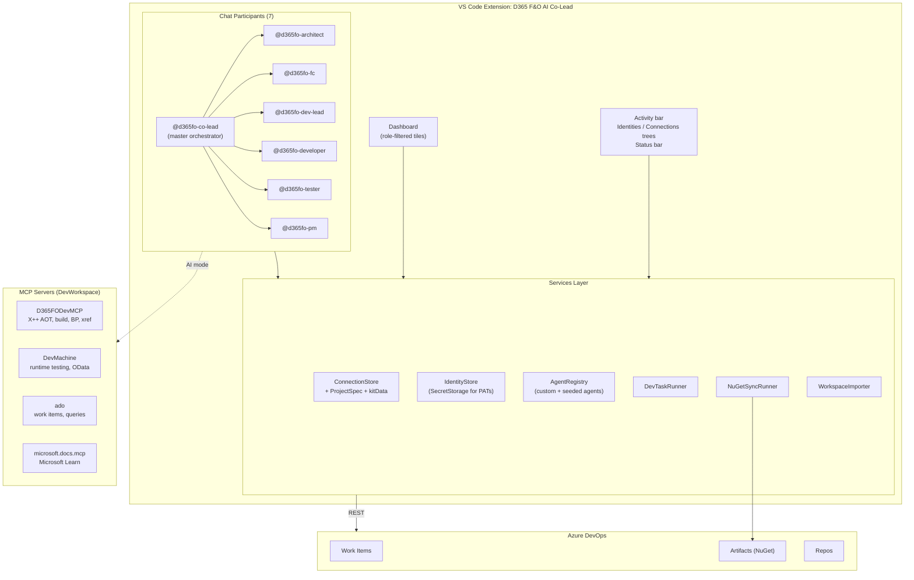
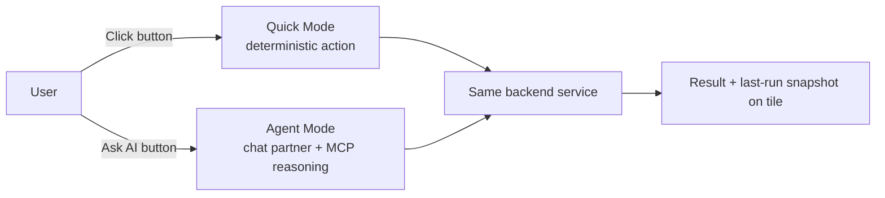
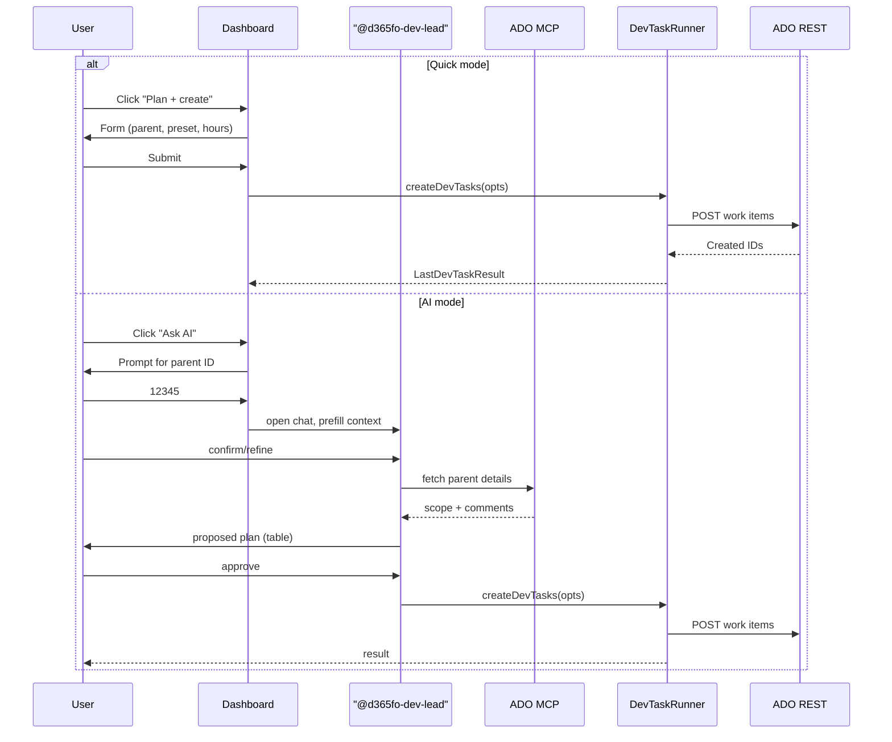

# Project Context — D365 F&O AI Co-Lead

> **Purpose of this document:** Single source of truth for *why this extension exists, how it's organised, what's done, and what's planned*. Read this first when resuming work in a new chat session — it lets the AI assistant (or a new contributor) get back into context fast.
>
> This file is the consolidated brain. Smaller docs:
> - [`README.md`](../README.md) — user-facing, role-segmented
> - [`ROADMAP.md`](../ROADMAP.md) — feature plan by version + role
> - [`CHANGELOG.md`](../CHANGELOG.md) — release history

---

## 1. Origin & vision

**Problem observed:**
Internal MS skills repos like [`ISDAIFirstAiBS`](https://github.com/mcaps-microsoft/ISDAIFirstAiBS/tree/main/.github/skills/) ship hand-edited markdown skills (TDD creator, FDD creator, release notes). Each skill is hardcoded for one delivery model — one ADO field naming, one branch model, one work item type — so they break the moment another project's spec differs. They also help only one persona (developer) and offer no way for end users to create their own agents.

**Vision:**
Build the **platform** instead of more hardcoded skills. One VS Code extension that:

1. Models a **per-project spec** (`ProjectSpec`) so the same agent adapts to every project's ADO/F&O conventions.
2. Provides **six role-aware Copilot Chat partners** so every delivery role gets a personalised AI partner, not just developers.
3. Ships an **in-product Agent Factory** so end users create their own agents without editing markdown.
4. Keeps **customer-specific data** out of the core (uses a `kitData` overlay slot — see CB Spec Kit).

This is the differentiator vs the skill-files approach. It's also the legitimate "AI agent suite" story for leadership — see Section 9.

## 2. Naming & identity

| Field | Value |
|---|---|
| Display name | `D365 Finance & Operations AI Co-Lead` |
| Short / status bar | `D365 F&O AI Co-Lead` / `$(rocket) D365 F&O Co-Lead: <project>` |
| Extension `name` | `d365fo-ai-co-lead` |
| Extension full ID | `vinodkumarkj12.d365fo-ai-co-lead` |
| Publisher | `vinodkumarkj12` (personal Marketplace) |
| GitHub repo (current local) | `d:/GitHub/GitHub-Personal/d365fo-devlead` *(folder still old name)* |
| GitHub repo (target) | `vjanardhana12/d365fo-ai-co-lead` |
| Tagline | *Your AI partner across the F&O delivery lifecycle — Architect, FC, Dev Lead, Developer, Tester, PM.* |

**Naming logic ("Co-Lead" with all roles):** the AI partners *whoever is leading a piece of work* — the dev lead on planning, the developer on implementation, the tester on validation, the FC on functional design. Not subordinate to one role.

## 3. Roles supported (v1.0)

Six roles, multi-select via `d365fo.myRoles` setting:

| Role ID | Display | Persona |
|---|---|---|
| `architect` | Solution / Delivery Architect | HLD, integration, ARB, NFRs |
| `fc` | Functional Consultant | FDDs, fit/gap, configuration, UAT |
| `dev-lead` | Development Lead | Dev tasks, PR triage, capacity, build |
| `developer` | Developer | Implements TDDs, X++, BP/UT fixes |
| `tester` | Tester | Test cases, execution, defect triage |
| `pm` | Project Manager | Status, burndown, risks (v1.2) |

**Hybrid roles** (e.g. techno-functional) = multi-select (`fc + developer`).

## 4. Architecture



### Two execution modes per tile



**Why this matters:** every feature has a click-driven path AND a chat-driven (AI) path that share the same backend. That's what makes it an *agent suite*, not just *automation with buttons*. See Section 9.

### Lifecycle of a Dev Task creation (example)



## 5. Code map

```
src/
├── extension.ts                # activation, wires services + commands + chat
├── services/
│   ├── connectionStore.ts      # Connection + ProjectSpec + kitData (globalState/workspaceState)
│   ├── identityStore.ts        # Identity + PAT (SecretStorage)
│   ├── agentRegistry.ts        # AgentDefinition CRUD + 6 seeded defaults  ← NEW v1.0
│   ├── devTaskRunner.ts        # ADO REST: create dev task hierarchy
│   ├── nugetSyncRunner.ts      # wrap d365fo-nuget-sync.ps1
│   ├── workspaceImporter.ts    # parse DevWorkspace JSON config files
│   └── adoClient.ts            # ADO REST helpers (testProject etc.)
├── commands/
│   ├── connectionCommands.ts
│   ├── identityCommands.ts
│   ├── nugetSyncCommand.ts
│   ├── devTasksCommand.ts
│   ├── projectKitCommand.ts
│   ├── cbSpecKitCommand.ts
│   ├── manageAgentsCommand.ts  # ← NEW v1.0
│   └── aiModeCommands.ts       # ← NEW v1.0 (Dev Tasks → Ask AI)
├── chat/
│   └── d365foParticipant.ts    # 7 chat participants (was 1) ← REWRITTEN v1.0
├── views/
│   ├── dashboardWebview.ts     # role-aware tiles + coming-soon roadmap
│   ├── formWebview.ts          # generic form helper
│   ├── connectionsTreeProvider.ts
│   └── identitiesTreeProvider.ts
└── webview/                    # webview UI bits
```

### State keys (preserved from v0.4.0 for upgrade safety)

| Key | Purpose |
|---|---|
| `d365fo.connections` | Connection[] |
| `d365fo.activeConnectionId` | string |
| `d365fo.identities` | Identity[] (PATs in SecretStorage) |
| `d365fo.agents.global` | AgentDefinition[] (NEW v1.0) |
| `d365fo.lastNuGetSyncResult` | last NuGet run snapshot |
| `d365fo.devTasks.lastInput` | last Dev Tasks form values |
| `d365fo.devTasks.lastResult` | last Dev Tasks run snapshot |

Migration to `d365foCoLead.*` namespace is on the v1.1 roadmap with one-time auto-copy.

## 6. ProjectSpec model

```ts
interface ProjectSpec {
  kit?: string;                          // 'generic' | 'carlsberg' | ...
  prefix?: string;                       // e.g. 'CHB'
  defaultModel?: string;
  defaultPackage?: string;
  packagesLocalDirectory?: string;
  customMetadataDirectory?: string;
  additionalMetadataDirectories?: string[];
  projectsDirectory?: string;
  labelLanguages?: string[];
  repoRoot?: string;
  iteration?: string;                    // ADO sprint
  defaultReviewer?: string;
  ceWorkItemType?: string;
  codeReviewPercent?: number;
  kitData?: Record<string, unknown>;     // free-form overlay slot
}
```

**Generic vs customer-specific:**

```
ProjectSpec
├── Generic fields              ← drives Create Dev Tasks, NuGet Sync, etc.
├── ADO defaults                ← used by every tile
└── kitData                     ← free-form overlay
    └── carlsberg               ← CB-only: ceCustomFields, taskCustomFields, stakeholders
```

Adding a new customer = new key under `kitData` + a new "kit edit" command. Core untouched.

## 7. Distribution & repo strategy

| Component | Repo | Account | Why |
|---|---|---|---|
| **Main extension** (`d365fo-ai-co-lead`) | `vjanardhana12/d365fo-ai-co-lead` | personal GitHub | Public, OSS |
| Marketplace publish | `vinodkumarkj12` publisher | personal Marketplace | Public install |
| **NuGet Sync script** (already standalone) | `vjanardhana12/d365fo-nuget-sync` | personal GitHub | Anyone can use without extension |
| **Future generic tiles** (when extracted) | own repos under `vjanardhana12` | personal GitHub | Composable plugins |
| **MS-internal-only** (eval datasets, internal LLM endpoints) | `mcaps-microsoft/<name>` | MS GitHub | IP / security |
| **Customer-specific kits** (CB Spec Kit etc.) | customer ADO repo | customer org | Customer IP, never on public GitHub |

**Pattern:** mono-cockpit + multi-engine. The extension is the host; tiles can be plugins from different repos. Anyone outside MS gets the public extension + public plugins. MS-internal users layer on internal plugins.

## 8. Decision log

Key decisions made during the rebrand:

| Decision | Choice | Rationale |
|---|---|---|
| Name | `D365 Finance & Operations AI Co-Lead` | Distinctive, role-implying, broad reading covers all 6 roles |
| Rename strategy | Hard rename → 1.0.0 | Clean break, big version bump for the milestone |
| Roles | 6 (architect/fc/dev-lead/developer/tester/pm) | Covers real distinct workflows; PM placeholder for v1.2 |
| Tech scope | F&O only | No CE/Power Platform mixing in v1.0 |
| State keys | Keep `d365fo.*` for v1.0 | Upgrade safety; rename to `d365foCoLead.*` in v1.1 with auto-migration |
| Internal command IDs | Keep `d365fo.*` for v1.0 | Same — minimise blast radius |
| Sharing model | Per-machine v1.0 → repo-committed `projectSpec` v1.1 | Ship now, add team sync next |
| Telemetry | Opt-in v1.1 | Need adoption metrics for LT pitch |
| Icon | Teal/cyan (two-figure + AI sparkle) | Distinct from old dark blue Dev Lead branding |
| Project Initiation Kit ownership | Architect, FC, Dev Lead | Whoever is first onboard creates; others consume the saved spec |

## 9. "Is this an agent suite or just automation?" — leadership pitch

**Honest answer:** v1.0 ships the *infrastructure* for an agent suite (chat participants, agent registry, MCP servers wired). v1.1 ships the *first wired-end-to-end* AI mode (Dev Tasks → Ask AI uses MCP reasoning).

**Talking points for LT:**

1. **Multi-agent platform**, not 5 hand-edited skill files: 6 role-aware Copilot Chat partners (`@d365fo-architect`, `@d365fo-fc`, `@d365fo-dev-lead`, `@d365fo-developer`, `@d365fo-tester`, `@d365fo-pm`) + master orchestrator (`@d365fo-co-lead`).
2. **Project-aware:** every agent adapts to the active project's `ProjectSpec`. Same agent, N projects, zero forking.
3. **In-product Agent Factory:** end users create their own agents without editing markdown. **No other internal D365 tool offers this.**
4. **Two surfaces, one backend:** click tiles for fast deterministic actions; ask the AI partner for reasoning. Both call the same services and MCP servers.
5. **Eval-ready:** per-agent eval datasets (v1.1) — measure quality regression on every prompt change. Most internal AI tools have zero eval coverage.
6. **Composable:** generic tools shipped as standalone OSS repos; customer-specific bits as `kitData` overlays. Clean IP separation.

**Recognition vehicles** (better than "patent" since it's likely MS IP):
- AIBS asset registry (internal accelerator with reuse metrics)
- MS Hackathon / Garage submission
- Tech Community blog + Show & Tell
- Adoption metrics from opt-in telemetry (v1.1)

## 10. Build & release

```powershell
# Set up Node (not in PATH by default on Vinod's machine)
$env:PATH = "C:\nvm4w\nodejs;$env:PATH"

# Build
cd d:/GitHub/GitHub-Personal/d365fo-devlead
npx tsc --noEmit                         # type-check (one pre-existing error in nugetSyncCommand.ts, ignore)
node esbuild.js --production             # bundle
npx vsce package                         # → d365fo-ai-co-lead-1.0.0.vsix

# Local install
code --install-extension d365fo-ai-co-lead-1.0.0.vsix --force
```

## 11. Repo / GitHub rename steps (when ready)

1. **Rename repo on GitHub:** `Settings` → rename `d365fo-devlead` → `d365fo-ai-co-lead`. GitHub auto-redirects old URL.
2. **Local remote update:**
   ```powershell
   cd d:/GitHub/GitHub-Personal/d365fo-devlead
   git remote set-url origin https://github.com/vjanardhana12/d365fo-ai-co-lead.git
   ```
3. **Optional: rename local folder** to match (close VS Code first, then `git mv` parent folder).
4. **Push 1.0.0:**
   ```powershell
   git add -A
   git commit -m "v1.0.0 - rebrand to D365 F&O AI Co-Lead, role-aware dashboard, agent factory"
   git tag v1.0.0
   git push origin main --tags
   ```
5. **GitHub Release:** attach `d365fo-ai-co-lead-1.0.0.vsix`, paste CHANGELOG entry as release notes.
6. **Marketplace publish:**
   ```powershell
   npx vsce publish --pat <marketplace-PAT>
   ```
   (or upload VSIX manually at https://marketplace.visualstudio.com/manage/publishers/vinodkumarkj12)
7. **Update [vjanardhana12.github.io](https://vjanardhana12.github.io)** with a "D365 F&O AI Co-Lead — coming soon to Marketplace" / "v1.0 shipped" banner.

## 12. Resuming a session

When opening a new chat:
1. Read this file (`docs/CONTEXT.md`).
2. Read `ROADMAP.md` for what's next.
3. Read `CHANGELOG.md` for what's done.
4. Run `git log --oneline -20` for the latest changes.

That's it. The dashboard's **Coming soon** section also lists the same roadmap, role-filtered.
